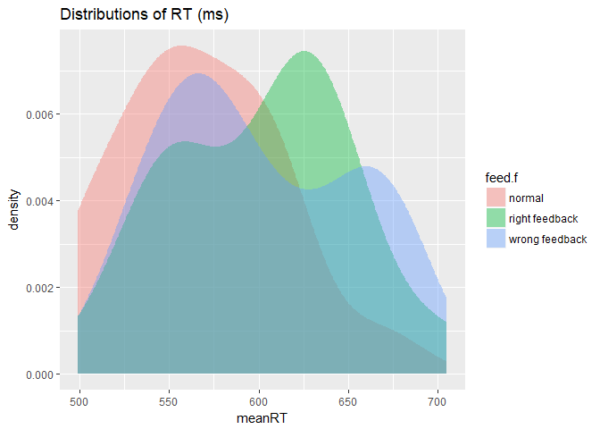
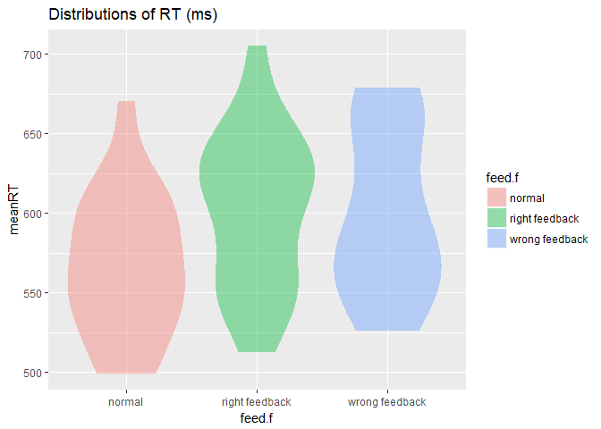
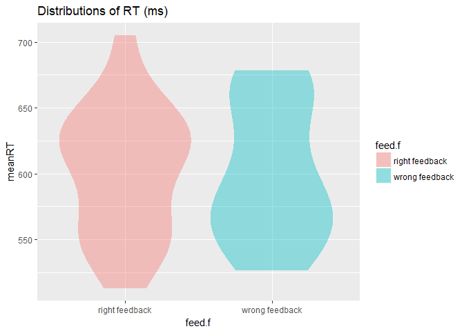

Read in data files


```r
data_path <- "./Daten/"
files     <- list.files(data_path)
data      <- list()

for(f in files){
  data[[f]] <- read.table(paste0(data_path,f), stringsAsFactors = FALSE,header=TRUE)
  
  if(f=="StopSignal_1802_bed1_vp13.txt"){
    data[[f]]$vp <- 13
  }
}

inhib <- bind_rows(data)
```


```r
head(inhib)
```

<div data-pagedtable="false">
  <script data-pagedtable-source type="application/json">
{"columns":[{"label":[""],"name":["_rn_"],"type":[""],"align":["left"]},{"label":["vp"],"name":[1],"type":["dbl"],"align":["right"]},{"label":["bed"],"name":[2],"type":["int"],"align":["right"]},{"label":["alt"],"name":[3],"type":["int"],"align":["right"]},{"label":["ges"],"name":[4],"type":["int"],"align":["right"]},{"label":["std"],"name":[5],"type":["int"],"align":["right"]},{"label":["block"],"name":[6],"type":["int"],"align":["right"]},{"label":["trg"],"name":[7],"type":["int"],"align":["right"]},{"label":["trial"],"name":[8],"type":["int"],"align":["right"]},{"label":["stnr"],"name":[9],"type":["int"],"align":["right"]},{"label":["zeile"],"name":[10],"type":["int"],"align":["right"]},{"label":["stim"],"name":[11],"type":["int"],"align":["right"]},{"label":["sneu"],"name":[12],"type":["int"],"align":["right"]},{"label":["kat"],"name":[13],"type":["int"],"align":["right"]},{"label":["stop"],"name":[14],"type":["int"],"align":["right"]},{"label":["ssd"],"name":[15],"type":["int"],"align":["right"]},{"label":["rgf"],"name":[16],"type":["int"],"align":["right"]},{"label":["res"],"name":[17],"type":["int"],"align":["right"]},{"label":["fehl"],"name":[18],"type":["int"],"align":["right"]},{"label":["eff"],"name":[19],"type":["int"],"align":["right"]},{"label":["krit"],"name":[20],"type":["int"],"align":["right"]},{"label":["feed"],"name":[21],"type":["int"],"align":["right"]},{"label":["rt"],"name":[22],"type":["dbl"],"align":["right"]},{"label":["verp"],"name":[23],"type":["int"],"align":["right"]},{"label":["iti"],"name":[24],"type":["dbl"],"align":["right"]},{"label":["ssd.1"],"name":[25],"type":["dbl"],"align":["right"]},{"label":["datum"],"name":[26],"type":["chr"],"align":["left"]}],"data":[{"1":"1","2":"1","3":"23","4":"2","5":"4","6":"1","7":"1","8":"1","9":"0","10":"1","11":"3","12":"3","13":"0","14":"0","15":"0","16":"120","17":"0","18":"0","19":"0","20":"0","21":"0","22":"0.0000","23":"1","24":"1100.001","25":"0","26":"02.22.2018","_rn_":"1"},{"1":"1","2":"1","3":"23","4":"2","5":"4","6":"1","7":"2","8":"2","9":"1","10":"1","11":"3","12":"3","13":"0","14":"0","15":"0","16":"120","17":"0","18":"0","19":"0","20":"0","21":"0","22":"0.0000","23":"2","24":"1100.000","25":"0","26":"02.22.2018","_rn_":"2"},{"1":"1","2":"1","3":"23","4":"2","5":"4","6":"1","7":"3","8":"3","9":"2","10":"1","11":"3","12":"3","13":"0","14":"0","15":"0","16":"120","17":"1","18":"0","19":"12","20":"0","21":"0","22":"997.1844","23":"2","24":"1100.001","25":"0","26":"02.22.2018","_rn_":"3"},{"1":"1","2":"1","3":"23","4":"2","5":"4","6":"1","7":"4","8":"4","9":"3","10":"1","11":"3","12":"3","13":"0","14":"0","15":"0","16":"120","17":"2","18":"0","19":"12","20":"0","21":"0","22":"889.0119","23":"2","24":"1100.000","25":"0","26":"02.22.2018","_rn_":"4"},{"1":"1","2":"1","3":"23","4":"2","5":"4","6":"1","7":"5","8":"5","9":"4","10":"1","11":"3","12":"3","13":"0","14":"0","15":"0","16":"120","17":"2","18":"0","19":"12","20":"0","21":"0","22":"652.8018","23":"2","24":"1100.001","25":"0","26":"02.22.2018","_rn_":"5"},{"1":"1","2":"1","3":"23","4":"2","5":"4","6":"1","7":"6","8":"6","9":"5","10":"1","11":"3","12":"3","13":"0","14":"0","15":"0","16":"120","17":"2","18":"0","19":"12","20":"0","21":"0","22":"896.6094","23":"2","24":"1100.001","25":"0","26":"02.22.2018","_rn_":"6"}],"options":{"columns":{"min":{},"max":[10]},"rows":{"min":[10],"max":[10]},"pages":{}}}
  </script>
</div>

# Participants


```r
demo <- inhib %>% dplyr::select(.,vp,alt,ges,std)  %>% group_by(.,vp)  %>%   
  summarise(age    = mean(alt, na.rm = T),
            gender = mean(ges, na.rm = T),
            std    = mean(std, na.rm = T)) %>% 
  mutate(., gender.f = factor(gender,label=c("male","female","NA"),levels=c(1,2,9)), 
            std.f    = factor(std,label=c("psychology","erziehungswiss","lehramt","other","NA"),
                       levels = c(1,2,3,4,9)))
```

### Gender


```r
      table(demo$gender.f)
```

```
## 
##   male female     NA 
##     10     11      1
```

```r
      table(demo$gender.f)/nrow(demo)
```

```
## 
##       male     female         NA 
## 0.45454545 0.50000000 0.04545455
```

### Age


```r
      psych::describe(demo$age) %>% knitr::kable(.)
```

      vars    n   mean         sd   median    trimmed      mad   min   max   range        skew     kurtosis          se
---  -----  ---  -----  ---------  -------  ---------  -------  ----  ----  ------  ----------  -----------  ----------
X1       1   22   26.5   4.317737       26   26.44444   4.4478    19    34      15   0.2456393   -0.9840568   0.9205447

```r
      hist(demo$age)
```

<!-- -->

### Course of Study


```r
      table(demo$std.f)
```

```
## 
##     psychology erziehungswiss        lehramt          other             NA 
##              7              0              9              6              0
```

```r
      table(demo$std.f)/nrow(demo)
```

```
## 
##     psychology erziehungswiss        lehramt          other             NA 
##      0.3181818      0.0000000      0.4090909      0.2727273      0.0000000
```


# Experiment

## Variable Label and Values

Variable      | Description                 | Values & Labels 
------------- | --------------------------  | ---------------------------------------
vp            | VPN ID                      | Nominal 1-22
alt           | Age                         | Integer 
ges           | Gender                      | Nominal 1 = male; 2=female
std           | Field of Study              | Nominal 1 = psychology; 2 = erziehungsw.; 3 = Lehramt; 4 = other
block         | Block Number                | Nominal 1 = instruction; 2 & 3 = training; 4-6 = testing
trg           | Overall trial number        | Integer
trial         | Trial number                | Integer
stnr          | ?                           | Integer
stim          | stimulus show in trial      | Nominal - even = Dogs, odd = Donuts, 01 = blue square, 02 = orange square
sneu          |  ??                         | ?
kat           | Category of stimulus        | Nominal  0 = square, 1 = donut, 2 = dog
stop          | Stop-trial or not           | Nominal 0 = no, 1 = yes 
ssd           | Stop-signal delay           | Integer 0,100,200 ms 
rgf           | response                    | Nominal 120 = left,right or nothing; Squares 1 = left, 2 = right ; DD  3 = left, 4 = right
resp          | given response              | Nominal 0 = nothing; Squares: 1 = left, 2 = right ; DD:  3 = left, 4 = right
fehl          | error                       | Nominal 0 = no, 1 = yes 
eff           | effect sound                | Nominal 0 = high/no-response sound, 12 = deep/response sound 
krit          | Critical trial or not       | Nominal 0 = no, 1 = yes 
feed          | Wrong or right feedback     | Nominal 0 = no feedback, 1 = right feedback, 2 = wrong feedback
rt            | reaction time               | Integer
verp          | misses                      | Integer 
iti           | true inter trial interval   | Integer  ~ 1100 ms 
ssd           | true Stop-signal delay      | Integer  ~ 0,100,200 ms
datum         | date                        | string 


## Trial informations

Next, I create three new variables, lag_crit, lag_error and lag_feed, where the entries of the krit,fehl and feed variables are shifted by one row, so I have the indication of the feedback type, if it is a critical trial and if the trial befor was wrong in the same row as the actual trial. At the end, I transform the feedback and block variables into  factors. 


```r
inhib <- inhib %>% dplyr::select(.,-trg,-trial,-stnr,-sneu, -iti,-datum) %>% 
                  mutate(., lag_crit = lag(krit) + 0,
                            lag_feed = lag(feed) + 0,
                            lag_error= lag(fehl) + 0) %>% 
                  dplyr::select(.,vp,alt,std,ges,block,rgf,res,stop,kat,krit,ssd,
                                  fehl,lag_feed,lag_crit,lag_error,rt) %>% 
                  mutate(.,feed.f=factor(lag_feed,levels=c(0,1,2),
                                         labels=c("normal","right feedback","wrong feedback")),
                           block.f=factor(block))


inhib %>%   group_by(vp,block.f) %>% summarise(., trials = length(res),
                                                        squareTrials = sum(kat==0),
                                                        catTrials = sum(kat!=0),
                                                        criticaltrials = sum(krit==1),
                                                        lagcriticaltrials = sum(lag_crit==1),
                                                        errors = sum(fehl==1),
                                                        stop = sum(stop==1)
                                                        )  
```

<div data-pagedtable="false">
  <script data-pagedtable-source type="application/json">
{"columns":[{"label":["vp"],"name":[1],"type":["dbl"],"align":["right"]},{"label":["block.f"],"name":[2],"type":["fctr"],"align":["left"]},{"label":["trials"],"name":[3],"type":["int"],"align":["right"]},{"label":["squareTrials"],"name":[4],"type":["int"],"align":["right"]},{"label":["catTrials"],"name":[5],"type":["int"],"align":["right"]},{"label":["criticaltrials"],"name":[6],"type":["int"],"align":["right"]},{"label":["lagcriticaltrials"],"name":[7],"type":["int"],"align":["right"]},{"label":["errors"],"name":[8],"type":["int"],"align":["right"]},{"label":["stop"],"name":[9],"type":["int"],"align":["right"]}],"data":[{"1":"1","2":"1","3":"70","4":"70","5":"0","6":"0","7":"NA","8":"0","9":"0"},{"1":"1","2":"2","3":"70","4":"70","5":"0","6":"0","7":"0","8":"4","9":"12"},{"1":"1","2":"3","3":"70","4":"40","5":"30","6":"10","7":"10","8":"2","9":"12"},{"1":"1","2":"4","3":"140","4":"80","5":"60","6":"20","7":"20","8":"2","9":"24"},{"1":"1","2":"5","3":"140","4":"80","5":"60","6":"20","7":"20","8":"4","9":"24"},{"1":"1","2":"6","3":"140","4":"80","5":"60","6":"20","7":"20","8":"7","9":"24"},{"1":"2","2":"1","3":"70","4":"70","5":"0","6":"0","7":"0","8":"0","9":"0"},{"1":"2","2":"2","3":"70","4":"70","5":"0","6":"0","7":"0","8":"5","9":"12"},{"1":"2","2":"3","3":"140","4":"80","5":"60","6":"20","7":"20","8":"14","9":"24"},{"1":"2","2":"4","3":"140","4":"80","5":"60","6":"20","7":"20","8":"8","9":"24"},{"1":"2","2":"5","3":"140","4":"80","5":"60","6":"20","7":"19","8":"11","9":"24"},{"1":"2","2":"6","3":"140","4":"80","5":"60","6":"20","7":"20","8":"7","9":"24"},{"1":"3","2":"1","3":"70","4":"70","5":"0","6":"0","7":"0","8":"0","9":"0"},{"1":"3","2":"2","3":"70","4":"70","5":"0","6":"0","7":"0","8":"5","9":"12"},{"1":"3","2":"3","3":"140","4":"80","5":"60","6":"20","7":"20","8":"20","9":"24"},{"1":"3","2":"4","3":"140","4":"80","5":"60","6":"20","7":"19","8":"15","9":"24"},{"1":"3","2":"5","3":"140","4":"80","5":"60","6":"20","7":"21","8":"16","9":"24"},{"1":"3","2":"6","3":"140","4":"80","5":"60","6":"20","7":"20","8":"17","9":"24"},{"1":"4","2":"1","3":"70","4":"70","5":"0","6":"0","7":"0","8":"0","9":"0"},{"1":"4","2":"2","3":"70","4":"70","5":"0","6":"0","7":"0","8":"8","9":"12"},{"1":"4","2":"3","3":"210","4":"120","5":"90","6":"30","7":"30","8":"38","9":"36"},{"1":"4","2":"4","3":"140","4":"80","5":"60","6":"20","7":"20","8":"8","9":"24"},{"1":"4","2":"5","3":"140","4":"80","5":"60","6":"20","7":"20","8":"14","9":"24"},{"1":"4","2":"6","3":"140","4":"80","5":"60","6":"20","7":"20","8":"13","9":"24"},{"1":"5","2":"1","3":"70","4":"70","5":"0","6":"0","7":"0","8":"0","9":"0"},{"1":"5","2":"2","3":"70","4":"70","5":"0","6":"0","7":"0","8":"5","9":"12"},{"1":"5","2":"3","3":"70","4":"40","5":"30","6":"10","7":"10","8":"7","9":"12"},{"1":"5","2":"4","3":"140","4":"80","5":"60","6":"20","7":"20","8":"19","9":"24"},{"1":"5","2":"5","3":"140","4":"80","5":"60","6":"20","7":"19","8":"15","9":"24"},{"1":"5","2":"6","3":"140","4":"80","5":"60","6":"20","7":"20","8":"10","9":"24"},{"1":"6","2":"1","3":"70","4":"70","5":"0","6":"0","7":"1","8":"0","9":"0"},{"1":"6","2":"2","3":"140","4":"140","5":"0","6":"0","7":"0","8":"30","9":"24"},{"1":"6","2":"3","3":"70","4":"40","5":"30","6":"10","7":"10","8":"8","9":"12"},{"1":"6","2":"4","3":"140","4":"80","5":"60","6":"20","7":"20","8":"15","9":"24"},{"1":"6","2":"5","3":"140","4":"80","5":"60","6":"20","7":"20","8":"19","9":"24"},{"1":"6","2":"6","3":"140","4":"80","5":"60","6":"20","7":"20","8":"29","9":"24"},{"1":"7","2":"1","3":"70","4":"70","5":"0","6":"0","7":"0","8":"0","9":"0"},{"1":"7","2":"2","3":"70","4":"70","5":"0","6":"0","7":"0","8":"2","9":"12"},{"1":"7","2":"3","3":"70","4":"40","5":"30","6":"10","7":"10","8":"4","9":"12"},{"1":"7","2":"4","3":"140","4":"80","5":"60","6":"20","7":"20","8":"12","9":"24"},{"1":"7","2":"5","3":"140","4":"80","5":"60","6":"20","7":"19","8":"5","9":"24"},{"1":"7","2":"6","3":"140","4":"80","5":"60","6":"20","7":"21","8":"5","9":"24"},{"1":"8","2":"1","3":"70","4":"70","5":"0","6":"0","7":"0","8":"0","9":"0"},{"1":"8","2":"2","3":"70","4":"70","5":"0","6":"0","7":"0","8":"6","9":"12"},{"1":"8","2":"3","3":"70","4":"40","5":"30","6":"10","7":"10","8":"3","9":"12"},{"1":"8","2":"4","3":"140","4":"80","5":"60","6":"20","7":"20","8":"6","9":"24"},{"1":"8","2":"5","3":"140","4":"80","5":"60","6":"20","7":"20","8":"9","9":"24"},{"1":"8","2":"6","3":"140","4":"80","5":"60","6":"20","7":"20","8":"4","9":"24"},{"1":"9","2":"1","3":"70","4":"70","5":"0","6":"0","7":"0","8":"0","9":"0"},{"1":"9","2":"2","3":"70","4":"70","5":"0","6":"0","7":"0","8":"9","9":"12"},{"1":"9","2":"3","3":"70","4":"40","5":"30","6":"10","7":"10","8":"7","9":"12"},{"1":"9","2":"4","3":"140","4":"80","5":"60","6":"20","7":"20","8":"14","9":"24"},{"1":"9","2":"5","3":"140","4":"80","5":"60","6":"20","7":"19","8":"11","9":"24"},{"1":"9","2":"6","3":"140","4":"80","5":"60","6":"20","7":"21","8":"9","9":"24"},{"1":"10","2":"1","3":"70","4":"70","5":"0","6":"0","7":"0","8":"0","9":"0"},{"1":"10","2":"2","3":"140","4":"140","5":"0","6":"0","7":"0","8":"111","9":"24"},{"1":"10","2":"3","3":"140","4":"80","5":"60","6":"20","7":"20","8":"61","9":"24"},{"1":"10","2":"4","3":"140","4":"80","5":"60","6":"20","7":"20","8":"59","9":"24"},{"1":"10","2":"5","3":"140","4":"80","5":"60","6":"20","7":"19","8":"62","9":"24"},{"1":"10","2":"6","3":"140","4":"80","5":"60","6":"20","7":"21","8":"9","9":"24"},{"1":"11","2":"1","3":"70","4":"70","5":"0","6":"0","7":"0","8":"0","9":"0"},{"1":"11","2":"2","3":"70","4":"70","5":"0","6":"0","7":"0","8":"5","9":"12"},{"1":"11","2":"3","3":"70","4":"40","5":"30","6":"10","7":"10","8":"3","9":"12"},{"1":"11","2":"4","3":"140","4":"80","5":"60","6":"20","7":"20","8":"5","9":"24"},{"1":"11","2":"5","3":"140","4":"80","5":"60","6":"20","7":"19","8":"4","9":"24"},{"1":"11","2":"6","3":"140","4":"80","5":"60","6":"20","7":"21","8":"2","9":"24"},{"1":"12","2":"1","3":"70","4":"70","5":"0","6":"0","7":"0","8":"0","9":"0"},{"1":"12","2":"2","3":"70","4":"70","5":"0","6":"0","7":"0","8":"8","9":"12"},{"1":"12","2":"3","3":"210","4":"120","5":"90","6":"30","7":"30","8":"37","9":"36"},{"1":"12","2":"4","3":"140","4":"80","5":"60","6":"20","7":"20","8":"18","9":"24"},{"1":"12","2":"5","3":"140","4":"80","5":"60","6":"20","7":"20","8":"20","9":"24"},{"1":"12","2":"6","3":"140","4":"80","5":"60","6":"20","7":"20","8":"13","9":"24"},{"1":"13","2":"1","3":"70","4":"70","5":"0","6":"0","7":"0","8":"0","9":"0"},{"1":"13","2":"2","3":"70","4":"70","5":"0","6":"0","7":"0","8":"8","9":"12"},{"1":"13","2":"3","3":"140","4":"80","5":"60","6":"20","7":"20","8":"21","9":"24"},{"1":"13","2":"4","3":"140","4":"80","5":"60","6":"20","7":"20","8":"6","9":"24"},{"1":"13","2":"5","3":"140","4":"80","5":"60","6":"20","7":"19","8":"5","9":"24"},{"1":"13","2":"6","3":"140","4":"80","5":"60","6":"20","7":"21","8":"5","9":"24"},{"1":"14","2":"1","3":"70","4":"70","5":"0","6":"0","7":"0","8":"0","9":"0"},{"1":"14","2":"2","3":"140","4":"140","5":"0","6":"0","7":"0","8":"16","9":"24"},{"1":"14","2":"3","3":"70","4":"40","5":"30","6":"10","7":"10","8":"10","9":"12"},{"1":"14","2":"4","3":"140","4":"80","5":"60","6":"20","7":"20","8":"8","9":"24"},{"1":"14","2":"5","3":"140","4":"80","5":"60","6":"20","7":"20","8":"9","9":"24"},{"1":"14","2":"6","3":"140","4":"80","5":"60","6":"20","7":"20","8":"7","9":"24"},{"1":"15","2":"1","3":"70","4":"70","5":"0","6":"0","7":"0","8":"0","9":"0"},{"1":"15","2":"2","3":"70","4":"70","5":"0","6":"0","7":"0","8":"6","9":"12"},{"1":"15","2":"3","3":"70","4":"40","5":"30","6":"10","7":"10","8":"9","9":"12"},{"1":"15","2":"4","3":"140","4":"80","5":"60","6":"20","7":"20","8":"14","9":"24"},{"1":"15","2":"5","3":"140","4":"80","5":"60","6":"20","7":"19","8":"22","9":"24"},{"1":"15","2":"6","3":"140","4":"80","5":"60","6":"20","7":"21","8":"16","9":"24"},{"1":"16","2":"1","3":"70","4":"70","5":"0","6":"0","7":"0","8":"0","9":"0"},{"1":"16","2":"2","3":"70","4":"70","5":"0","6":"0","7":"0","8":"1","9":"12"},{"1":"16","2":"3","3":"70","4":"40","5":"30","6":"10","7":"10","8":"4","9":"12"},{"1":"16","2":"4","3":"140","4":"80","5":"60","6":"20","7":"20","8":"4","9":"24"},{"1":"16","2":"5","3":"140","4":"80","5":"60","6":"20","7":"20","8":"7","9":"24"},{"1":"16","2":"6","3":"140","4":"80","5":"60","6":"20","7":"20","8":"2","9":"24"},{"1":"17","2":"1","3":"70","4":"70","5":"0","6":"0","7":"0","8":"0","9":"0"},{"1":"17","2":"2","3":"70","4":"70","5":"0","6":"0","7":"0","8":"1","9":"12"},{"1":"17","2":"3","3":"70","4":"40","5":"30","6":"10","7":"10","8":"4","9":"12"},{"1":"17","2":"4","3":"140","4":"80","5":"60","6":"20","7":"20","8":"9","9":"24"},{"1":"17","2":"5","3":"140","4":"80","5":"60","6":"20","7":"20","8":"18","9":"24"},{"1":"17","2":"6","3":"140","4":"80","5":"60","6":"20","7":"20","8":"13","9":"24"},{"1":"18","2":"1","3":"70","4":"70","5":"0","6":"0","7":"0","8":"0","9":"0"},{"1":"18","2":"2","3":"70","4":"70","5":"0","6":"0","7":"0","8":"5","9":"12"},{"1":"18","2":"3","3":"70","4":"40","5":"30","6":"10","7":"10","8":"10","9":"12"},{"1":"18","2":"4","3":"140","4":"80","5":"60","6":"20","7":"19","8":"62","9":"24"},{"1":"18","2":"5","3":"140","4":"80","5":"60","6":"20","7":"21","8":"55","9":"24"},{"1":"18","2":"6","3":"140","4":"80","5":"60","6":"20","7":"20","8":"12","9":"24"},{"1":"19","2":"1","3":"70","4":"70","5":"0","6":"0","7":"0","8":"0","9":"0"},{"1":"19","2":"2","3":"70","4":"70","5":"0","6":"0","7":"0","8":"7","9":"12"},{"1":"19","2":"3","3":"70","4":"40","5":"30","6":"10","7":"10","8":"5","9":"12"},{"1":"19","2":"4","3":"140","4":"80","5":"60","6":"20","7":"20","8":"8","9":"24"},{"1":"19","2":"5","3":"140","4":"80","5":"60","6":"20","7":"20","8":"4","9":"24"},{"1":"19","2":"6","3":"140","4":"80","5":"60","6":"20","7":"20","8":"8","9":"24"},{"1":"20","2":"1","3":"70","4":"70","5":"0","6":"0","7":"1","8":"0","9":"0"},{"1":"20","2":"2","3":"70","4":"70","5":"0","6":"0","7":"0","8":"3","9":"12"},{"1":"20","2":"3","3":"70","4":"40","5":"30","6":"10","7":"10","8":"5","9":"12"},{"1":"20","2":"4","3":"140","4":"80","5":"60","6":"20","7":"19","8":"2","9":"24"},{"1":"20","2":"5","3":"140","4":"80","5":"60","6":"20","7":"21","8":"7","9":"24"},{"1":"20","2":"6","3":"140","4":"80","5":"60","6":"20","7":"20","8":"6","9":"24"},{"1":"21","2":"1","3":"70","4":"70","5":"0","6":"0","7":"0","8":"0","9":"0"},{"1":"21","2":"2","3":"70","4":"70","5":"0","6":"0","7":"0","8":"6","9":"12"},{"1":"21","2":"3","3":"140","4":"80","5":"60","6":"20","7":"20","8":"36","9":"24"},{"1":"21","2":"4","3":"140","4":"80","5":"60","6":"20","7":"20","8":"2","9":"24"},{"1":"21","2":"5","3":"140","4":"80","5":"60","6":"20","7":"20","8":"4","9":"24"},{"1":"21","2":"6","3":"140","4":"80","5":"60","6":"20","7":"19","8":"16","9":"24"},{"1":"22","2":"1","3":"70","4":"70","5":"0","6":"0","7":"1","8":"0","9":"0"},{"1":"22","2":"2","3":"70","4":"70","5":"0","6":"0","7":"0","8":"5","9":"12"},{"1":"22","2":"3","3":"70","4":"40","5":"30","6":"10","7":"10","8":"5","9":"12"},{"1":"22","2":"4","3":"140","4":"80","5":"60","6":"20","7":"20","8":"8","9":"24"},{"1":"22","2":"5","3":"140","4":"80","5":"60","6":"20","7":"20","8":"12","9":"24"},{"1":"22","2":"6","3":"140","4":"80","5":"60","6":"20","7":"20","8":"9","9":"24"}],"options":{"columns":{"min":{},"max":[10]},"rows":{"min":[10],"max":[10]},"pages":{}}}
  </script>
</div>

```r
#test <- inhib %>% filter(.,vp ==3, block == 4 | block == 5)# 140 -> 141
```


## Analysis


First, I filter only for those trials in the experimental blocks 4-6 were the stimulus was a dog or a donut


```r
inhib_crit <-  filter(inhib, block == 4 | block == 5 | block == 6, kat == 1 | kat == 2)
```


### Critical trials, errors and mean & median RT per person


```r
inhib_crit %>% group_by(vp) %>% summarise(., trials = length(res),
                                             criticaltrials = sum(lag_crit==1),
                                             errors = sum(fehl==1),
                                             lag_errors = sum(lag_error==1),
                                             errorrate = errors/trials,
                                             meanRT = mean(rt),
                                             medianRT = median(rt),
                                             diffMeanMedian = meanRT-medianRT)  %>%  knitr::kable(.)
```


 vp   trials   criticaltrials   errors   lag_errors   errorrate     meanRT   medianRT   diffMeanMedian
---  -------  ---------------  -------  -----------  ----------  ---------  ---------  ---------------
  1      180               60        4            4   0.0222222   503.4709   502.2512         1.219694
  2      180               59        5            3   0.0277778   534.0199   531.5727         2.447211
  3      180               60       24           24   0.1333333   570.4207   609.2445       -38.823821
  4      180               60       10           11   0.0555556   661.7285   665.7622        -4.033619
  5      180               59       14           19   0.0777778   566.8308   572.5443        -5.713548
  6      180               60       31           24   0.1722222   600.9195   628.8779       -27.958409
  7      180               59        4            3   0.0222222   603.6619   598.2342         5.427707
  8      180               60        0           10   0.0000000   544.5427   531.5130        13.029756
  9      180               60        4            7   0.0222222   593.1743   589.9266         3.247636
 10      180               59        4            8   0.0222222   604.2257   617.9935       -13.767768
 11      180               59        0            7   0.0000000   542.2122   547.9417        -5.729524
 12      180               60        9           10   0.0500000   604.0344   612.0052        -7.970868
 13      180               59        2            4   0.0111111   546.4725   542.9792         3.493267
 14      180               60        5            7   0.0277778   600.9711   599.3418         1.629354
 15      180               60        3           10   0.0166667   567.8581   566.3217         1.536454
 16      180               60        1            3   0.0055556   515.2684   520.7478        -5.479391
 17      180               60        7           11   0.0388889   563.5538   568.7484        -5.194593
 18      180               59       99           70   0.5500000   574.5874   578.6523        -4.064921
 19      180               60        0            6   0.0000000   548.7362   539.6148         9.121364
 20      180               59        4            6   0.0222222   611.9694   623.1285       -11.159104
 21      180               59        1            1   0.0055556   565.6854   561.8507         3.834735
 22      180               60        5            2   0.0277778   578.0701   569.3935         8.676647

There are some people with a high error rate (>10 %) even in this easy task. I will exclude all participants with an error rate > 10 %.


```r
inhib_crit <- filter(inhib_crit,vp !=3 & vp != 6 & vp != 18)
```

#### Updated Demographics: 


```r
demo <- inhib %>% dplyr::select(.,vp,alt,ges,std) %>% 
        filter(.,vp !=3 & vp != 6 & vp != 18) %>% group_by(.,vp)  %>%   
        summarise(age = mean(alt, na.rm = T),
                  gender = mean(ges, na.rm = T),
                  std = mean(std, na.rm = T)) %>% 
        mutate(., gender.f = factor(gender,labels=c("male","female","NA"),levels=c(1,2,9)), 
                  std.f = factor(std,labels=c("psychology","erziehungswiss","lehramt","other","NA"),
                            levels=c(1,2,3,4,9)))
  

psych::describe(demo$age) %>% knitr::kable()
```

      vars    n       mean         sd   median    trimmed      mad   min   max   range        skew    kurtosis         se
---  -----  ---  ---------  ---------  -------  ---------  -------  ----  ----  ------  ----------  ----------  ---------
X1       1   19   26.42105   4.646573       26   26.41176   4.4478    19    34      15   0.2747343   -1.243187   1.065997

```r
table(demo$gender.f)
```

```
## 
##   male female     NA 
##      9     10      0
```


#### Looking at the errors people made: 


```r
filter(inhib_crit,fehl==1)
```

<div data-pagedtable="false">
  <script data-pagedtable-source type="application/json">
{"columns":[{"label":["vp"],"name":[1],"type":["dbl"],"align":["right"]},{"label":["alt"],"name":[2],"type":["int"],"align":["right"]},{"label":["std"],"name":[3],"type":["int"],"align":["right"]},{"label":["ges"],"name":[4],"type":["int"],"align":["right"]},{"label":["block"],"name":[5],"type":["int"],"align":["right"]},{"label":["rgf"],"name":[6],"type":["int"],"align":["right"]},{"label":["res"],"name":[7],"type":["int"],"align":["right"]},{"label":["stop"],"name":[8],"type":["int"],"align":["right"]},{"label":["kat"],"name":[9],"type":["int"],"align":["right"]},{"label":["krit"],"name":[10],"type":["int"],"align":["right"]},{"label":["ssd"],"name":[11],"type":["int"],"align":["right"]},{"label":["fehl"],"name":[12],"type":["int"],"align":["right"]},{"label":["lag_feed"],"name":[13],"type":["dbl"],"align":["right"]},{"label":["lag_crit"],"name":[14],"type":["dbl"],"align":["right"]},{"label":["lag_error"],"name":[15],"type":["dbl"],"align":["right"]},{"label":["rt"],"name":[16],"type":["dbl"],"align":["right"]},{"label":["feed.f"],"name":[17],"type":["fctr"],"align":["left"]},{"label":["block.f"],"name":[18],"type":["fctr"],"align":["left"]}],"data":[{"1":"1","2":"23","3":"4","4":"2","5":"5","6":"3","7":"0","8":"0","9":"2","10":"0","11":"0","12":"1","13":"0","14":"0","15":"0","16":"0.0000","17":"normal","18":"5"},{"1":"1","2":"23","3":"4","4":"2","5":"6","6":"3","7":"4","8":"0","9":"2","10":"0","11":"0","12":"1","13":"0","14":"0","15":"0","16":"382.0808","17":"normal","18":"6"},{"1":"1","2":"23","3":"4","4":"2","5":"6","6":"3","7":"4","8":"0","9":"2","10":"0","11":"0","12":"1","13":"0","14":"0","15":"0","16":"399.7928","17":"normal","18":"6"},{"1":"1","2":"23","3":"4","4":"2","5":"6","6":"3","7":"4","8":"0","9":"2","10":"0","11":"0","12":"1","13":"0","14":"0","15":"0","16":"399.5376","17":"normal","18":"6"},{"1":"10","2":"32","3":"1","4":"2","5":"5","6":"3","7":"0","8":"0","9":"1","10":"0","11":"0","12":"1","13":"0","14":"0","15":"0","16":"0.0000","17":"normal","18":"5"},{"1":"10","2":"32","3":"1","4":"2","5":"5","6":"3","7":"0","8":"0","9":"1","10":"0","11":"0","12":"1","13":"0","14":"0","15":"0","16":"0.0000","17":"normal","18":"5"},{"1":"10","2":"32","3":"1","4":"2","5":"6","6":"3","7":"0","8":"0","9":"1","10":"0","11":"0","12":"1","13":"2","14":"1","15":"0","16":"0.0000","17":"wrong feedback","18":"6"},{"1":"10","2":"32","3":"1","4":"2","5":"6","6":"4","7":"3","8":"0","9":"2","10":"0","11":"0","12":"1","13":"0","14":"0","15":"0","16":"458.2293","17":"normal","18":"6"},{"1":"12","2":"29","3":"1","4":"1","5":"4","6":"3","7":"0","8":"0","9":"1","10":"0","11":"0","12":"1","13":"0","14":"0","15":"0","16":"0.0000","17":"normal","18":"4"},{"1":"12","2":"29","3":"1","4":"1","5":"4","6":"4","7":"0","8":"0","9":"2","10":"0","11":"0","12":"1","13":"2","14":"1","15":"0","16":"0.0000","17":"wrong feedback","18":"4"},{"1":"12","2":"29","3":"1","4":"1","5":"4","6":"3","7":"0","8":"0","9":"1","10":"0","11":"0","12":"1","13":"2","14":"1","15":"0","16":"0.0000","17":"wrong feedback","18":"4"},{"1":"12","2":"29","3":"1","4":"1","5":"5","6":"3","7":"0","8":"0","9":"1","10":"0","11":"0","12":"1","13":"1","14":"1","15":"0","16":"0.0000","17":"right feedback","18":"5"},{"1":"12","2":"29","3":"1","4":"1","5":"5","6":"4","7":"0","8":"0","9":"2","10":"0","11":"0","12":"1","13":"0","14":"0","15":"1","16":"0.0000","17":"normal","18":"5"},{"1":"12","2":"29","3":"1","4":"1","5":"5","6":"3","7":"0","8":"0","9":"1","10":"0","11":"0","12":"1","13":"0","14":"0","15":"0","16":"0.0000","17":"normal","18":"5"},{"1":"12","2":"29","3":"1","4":"1","5":"6","6":"3","7":"4","8":"0","9":"1","10":"0","11":"0","12":"1","13":"1","14":"1","15":"0","16":"490.9985","17":"right feedback","18":"6"},{"1":"12","2":"29","3":"1","4":"1","5":"6","6":"4","7":"0","8":"0","9":"2","10":"0","11":"0","12":"1","13":"0","14":"0","15":"0","16":"0.0000","17":"normal","18":"6"},{"1":"12","2":"29","3":"1","4":"1","5":"6","6":"4","7":"3","8":"0","9":"2","10":"0","11":"0","12":"1","13":"0","14":"0","15":"0","16":"469.9365","17":"normal","18":"6"},{"1":"13","2":"26","3":"3","4":"1","5":"4","6":"4","7":"0","8":"0","9":"2","10":"0","11":"0","12":"1","13":"2","14":"1","15":"0","16":"0.0000","17":"wrong feedback","18":"4"},{"1":"13","2":"26","3":"3","4":"1","5":"5","6":"4","7":"0","8":"0","9":"2","10":"0","11":"0","12":"1","13":"2","14":"1","15":"0","16":"0.0000","17":"wrong feedback","18":"5"},{"1":"14","2":"22","3":"4","4":"1","5":"4","6":"4","7":"0","8":"0","9":"2","10":"0","11":"0","12":"1","13":"0","14":"0","15":"0","16":"0.0000","17":"normal","18":"4"},{"1":"14","2":"22","3":"4","4":"1","5":"5","6":"4","7":"2","8":"0","9":"2","10":"0","11":"0","12":"1","13":"0","14":"0","15":"0","16":"660.6120","17":"normal","18":"5"},{"1":"14","2":"22","3":"4","4":"1","5":"6","6":"4","7":"0","8":"0","9":"2","10":"0","11":"0","12":"1","13":"0","14":"0","15":"0","16":"0.0000","17":"normal","18":"6"},{"1":"14","2":"22","3":"4","4":"1","5":"6","6":"4","7":"0","8":"0","9":"2","10":"0","11":"0","12":"1","13":"0","14":"0","15":"0","16":"0.0000","17":"normal","18":"6"},{"1":"14","2":"22","3":"4","4":"1","5":"6","6":"4","7":"2","8":"0","9":"2","10":"0","11":"0","12":"1","13":"0","14":"0","15":"0","16":"977.5811","17":"normal","18":"6"},{"1":"15","2":"33","3":"3","4":"1","5":"4","6":"4","7":"3","8":"0","9":"1","10":"0","11":"0","12":"1","13":"0","14":"0","15":"0","16":"452.7531","17":"normal","18":"4"},{"1":"15","2":"33","3":"3","4":"1","5":"5","6":"3","7":"0","8":"0","9":"2","10":"0","11":"0","12":"1","13":"2","14":"1","15":"0","16":"0.0000","17":"wrong feedback","18":"5"},{"1":"15","2":"33","3":"3","4":"1","5":"6","6":"4","7":"3","8":"0","9":"1","10":"0","11":"0","12":"1","13":"0","14":"0","15":"0","16":"617.3442","17":"normal","18":"6"},{"1":"16","2":"19","3":"1","4":"2","5":"4","6":"3","7":"4","8":"0","9":"1","10":"0","11":"0","12":"1","13":"0","14":"0","15":"0","16":"433.1465","17":"normal","18":"4"},{"1":"17","2":"28","3":"1","4":"2","5":"5","6":"3","7":"4","8":"0","9":"2","10":"0","11":"0","12":"1","13":"0","14":"0","15":"0","16":"498.9928","17":"normal","18":"5"},{"1":"17","2":"28","3":"1","4":"2","5":"5","6":"4","7":"3","8":"0","9":"1","10":"0","11":"0","12":"1","13":"0","14":"0","15":"0","16":"460.6762","17":"normal","18":"5"},{"1":"17","2":"28","3":"1","4":"2","5":"6","6":"4","7":"0","8":"0","9":"1","10":"0","11":"0","12":"1","13":"1","14":"1","15":"1","16":"0.0000","17":"right feedback","18":"6"},{"1":"17","2":"28","3":"1","4":"2","5":"6","6":"4","7":"3","8":"0","9":"1","10":"0","11":"0","12":"1","13":"1","14":"1","15":"0","16":"724.1655","17":"right feedback","18":"6"},{"1":"17","2":"28","3":"1","4":"2","5":"6","6":"3","7":"0","8":"0","9":"2","10":"0","11":"0","12":"1","13":"0","14":"0","15":"0","16":"0.0000","17":"normal","18":"6"},{"1":"17","2":"28","3":"1","4":"2","5":"6","6":"3","7":"0","8":"0","9":"2","10":"0","11":"0","12":"1","13":"0","14":"0","15":"0","16":"0.0000","17":"normal","18":"6"},{"1":"17","2":"28","3":"1","4":"2","5":"6","6":"3","7":"0","8":"0","9":"2","10":"0","11":"0","12":"1","13":"0","14":"0","15":"0","16":"0.0000","17":"normal","18":"6"},{"1":"2","2":"24","3":"4","4":"2","5":"5","6":"4","7":"0","8":"0","9":"2","10":"0","11":"0","12":"1","13":"1","14":"0","15":"0","16":"0.0000","17":"right feedback","18":"5"},{"1":"2","2":"24","3":"4","4":"2","5":"5","6":"3","7":"4","8":"0","9":"1","10":"0","11":"0","12":"1","13":"0","14":"0","15":"0","16":"428.3929","17":"normal","18":"5"},{"1":"2","2":"24","3":"4","4":"2","5":"5","6":"3","7":"4","8":"0","9":"1","10":"0","11":"0","12":"1","13":"0","14":"0","15":"0","16":"414.1395","17":"normal","18":"5"},{"1":"2","2":"24","3":"4","4":"2","5":"6","6":"4","7":"0","8":"0","9":"2","10":"0","11":"0","12":"1","13":"1","14":"1","15":"0","16":"0.0000","17":"right feedback","18":"6"},{"1":"2","2":"24","3":"4","4":"2","5":"6","6":"4","7":"3","8":"0","9":"2","10":"0","11":"0","12":"1","13":"0","14":"0","15":"0","16":"481.8021","17":"normal","18":"6"},{"1":"20","2":"34","3":"3","4":"2","5":"4","6":"3","7":"0","8":"0","9":"1","10":"0","11":"0","12":"1","13":"1","14":"1","15":"0","16":"0.0000","17":"right feedback","18":"4"},{"1":"20","2":"34","3":"3","4":"2","5":"5","6":"3","7":"0","8":"0","9":"1","10":"0","11":"0","12":"1","13":"1","14":"1","15":"0","16":"0.0000","17":"right feedback","18":"5"},{"1":"20","2":"34","3":"3","4":"2","5":"5","6":"4","7":"0","8":"0","9":"2","10":"0","11":"0","12":"1","13":"0","14":"0","15":"0","16":"0.0000","17":"normal","18":"5"},{"1":"20","2":"34","3":"3","4":"2","5":"6","6":"3","7":"0","8":"0","9":"1","10":"0","11":"0","12":"1","13":"2","14":"1","15":"0","16":"0.0000","17":"wrong feedback","18":"6"},{"1":"21","2":"26","3":"4","4":"1","5":"6","6":"4","7":"0","8":"0","9":"1","10":"0","11":"0","12":"1","13":"0","14":"0","15":"0","16":"0.0000","17":"normal","18":"6"},{"1":"22","2":"23","3":"3","4":"1","5":"4","6":"4","7":"3","8":"0","9":"2","10":"0","11":"0","12":"1","13":"0","14":"0","15":"0","16":"549.1133","17":"normal","18":"4"},{"1":"22","2":"23","3":"3","4":"1","5":"5","6":"4","7":"3","8":"0","9":"2","10":"0","11":"0","12":"1","13":"0","14":"0","15":"0","16":"518.7309","17":"normal","18":"5"},{"1":"22","2":"23","3":"3","4":"1","5":"5","6":"3","7":"4","8":"0","9":"1","10":"0","11":"0","12":"1","13":"0","14":"0","15":"0","16":"465.5505","17":"normal","18":"5"},{"1":"22","2":"23","3":"3","4":"1","5":"5","6":"4","7":"3","8":"0","9":"2","10":"0","11":"0","12":"1","13":"0","14":"0","15":"0","16":"594.9057","17":"normal","18":"5"},{"1":"22","2":"23","3":"3","4":"1","5":"6","6":"4","7":"3","8":"0","9":"2","10":"0","11":"0","12":"1","13":"0","14":"0","15":"0","16":"512.7904","17":"normal","18":"6"},{"1":"4","2":"24","3":"4","4":"1","5":"4","6":"4","7":"0","8":"0","9":"2","10":"0","11":"0","12":"1","13":"2","14":"1","15":"0","16":"0.0000","17":"wrong feedback","18":"4"},{"1":"4","2":"24","3":"4","4":"1","5":"4","6":"4","7":"0","8":"0","9":"2","10":"0","11":"0","12":"1","13":"0","14":"0","15":"0","16":"0.0000","17":"normal","18":"4"},{"1":"4","2":"24","3":"4","4":"1","5":"4","6":"4","7":"0","8":"0","9":"2","10":"0","11":"0","12":"1","13":"0","14":"0","15":"0","16":"0.0000","17":"normal","18":"4"},{"1":"4","2":"24","3":"4","4":"1","5":"4","6":"3","7":"0","8":"0","9":"1","10":"0","11":"0","12":"1","13":"0","14":"0","15":"0","16":"0.0000","17":"normal","18":"4"},{"1":"4","2":"24","3":"4","4":"1","5":"5","6":"3","7":"2","8":"0","9":"1","10":"0","11":"0","12":"1","13":"1","14":"1","15":"0","16":"747.0639","17":"right feedback","18":"5"},{"1":"4","2":"24","3":"4","4":"1","5":"5","6":"4","7":"3","8":"0","9":"2","10":"0","11":"0","12":"1","13":"0","14":"0","15":"1","16":"991.9438","17":"normal","18":"5"},{"1":"4","2":"24","3":"4","4":"1","5":"5","6":"4","7":"3","8":"0","9":"2","10":"0","11":"0","12":"1","13":"2","14":"1","15":"0","16":"752.3649","17":"wrong feedback","18":"5"},{"1":"4","2":"24","3":"4","4":"1","5":"5","6":"4","7":"3","8":"0","9":"2","10":"0","11":"0","12":"1","13":"2","14":"1","15":"0","16":"896.6622","17":"wrong feedback","18":"5"},{"1":"4","2":"24","3":"4","4":"1","5":"6","6":"4","7":"3","8":"0","9":"2","10":"0","11":"0","12":"1","13":"0","14":"0","15":"0","16":"728.4137","17":"normal","18":"6"},{"1":"4","2":"24","3":"4","4":"1","5":"6","6":"4","7":"0","8":"0","9":"2","10":"0","11":"0","12":"1","13":"2","14":"1","15":"0","16":"0.0000","17":"wrong feedback","18":"6"},{"1":"5","2":"24","3":"3","4":"2","5":"4","6":"3","7":"0","8":"0","9":"2","10":"0","11":"0","12":"1","13":"1","14":"1","15":"0","16":"0.0000","17":"right feedback","18":"4"},{"1":"5","2":"24","3":"3","4":"2","5":"4","6":"4","7":"3","8":"0","9":"1","10":"0","11":"0","12":"1","13":"1","14":"1","15":"0","16":"526.3732","17":"right feedback","18":"4"},{"1":"5","2":"24","3":"3","4":"2","5":"4","6":"4","7":"0","8":"0","9":"1","10":"0","11":"0","12":"1","13":"1","14":"1","15":"0","16":"0.0000","17":"right feedback","18":"4"},{"1":"5","2":"24","3":"3","4":"2","5":"4","6":"3","7":"4","8":"0","9":"2","10":"0","11":"0","12":"1","13":"0","14":"0","15":"0","16":"472.5715","17":"normal","18":"4"},{"1":"5","2":"24","3":"3","4":"2","5":"4","6":"4","7":"0","8":"0","9":"1","10":"0","11":"0","12":"1","13":"2","14":"1","15":"0","16":"0.0000","17":"wrong feedback","18":"4"},{"1":"5","2":"24","3":"3","4":"2","5":"4","6":"3","7":"0","8":"0","9":"2","10":"0","11":"0","12":"1","13":"0","14":"0","15":"1","16":"0.0000","17":"normal","18":"4"},{"1":"5","2":"24","3":"3","4":"2","5":"4","6":"3","7":"0","8":"0","9":"2","10":"0","11":"0","12":"1","13":"0","14":"0","15":"0","16":"0.0000","17":"normal","18":"4"},{"1":"5","2":"24","3":"3","4":"2","5":"4","6":"3","7":"0","8":"0","9":"2","10":"0","11":"0","12":"1","13":"0","14":"0","15":"0","16":"0.0000","17":"normal","18":"4"},{"1":"5","2":"24","3":"3","4":"2","5":"5","6":"3","7":"0","8":"0","9":"2","10":"0","11":"0","12":"1","13":"1","14":"0","15":"0","16":"0.0000","17":"right feedback","18":"5"},{"1":"5","2":"24","3":"3","4":"2","5":"5","6":"4","7":"3","8":"0","9":"1","10":"0","11":"0","12":"1","13":"2","14":"1","15":"0","16":"630.6131","17":"wrong feedback","18":"5"},{"1":"5","2":"24","3":"3","4":"2","5":"5","6":"3","7":"4","8":"0","9":"2","10":"0","11":"0","12":"1","13":"0","14":"0","15":"0","16":"480.4255","17":"normal","18":"5"},{"1":"5","2":"24","3":"3","4":"2","5":"5","6":"3","7":"0","8":"0","9":"2","10":"0","11":"0","12":"1","13":"1","14":"1","15":"0","16":"0.0000","17":"right feedback","18":"5"},{"1":"5","2":"24","3":"3","4":"2","5":"5","6":"4","7":"3","8":"0","9":"1","10":"0","11":"0","12":"1","13":"0","14":"0","15":"0","16":"947.2395","17":"normal","18":"5"},{"1":"5","2":"24","3":"3","4":"2","5":"6","6":"4","7":"3","8":"0","9":"1","10":"0","11":"0","12":"1","13":"0","14":"0","15":"0","16":"734.5448","17":"normal","18":"6"},{"1":"7","2":"27","3":"3","4":"1","5":"4","6":"3","7":"4","8":"0","9":"2","10":"0","11":"0","12":"1","13":"2","14":"1","15":"0","16":"902.3065","17":"wrong feedback","18":"4"},{"1":"7","2":"27","3":"3","4":"1","5":"4","6":"3","7":"0","8":"0","9":"2","10":"0","11":"0","12":"1","13":"0","14":"0","15":"0","16":"0.0000","17":"normal","18":"4"},{"1":"7","2":"27","3":"3","4":"1","5":"4","6":"4","7":"0","8":"0","9":"1","10":"0","11":"0","12":"1","13":"0","14":"0","15":"0","16":"0.0000","17":"normal","18":"4"},{"1":"7","2":"27","3":"3","4":"1","5":"5","6":"3","7":"0","8":"0","9":"2","10":"0","11":"0","12":"1","13":"0","14":"0","15":"0","16":"0.0000","17":"normal","18":"5"},{"1":"9","2":"31","3":"1","4":"1","5":"4","6":"4","7":"3","8":"0","9":"1","10":"0","11":"0","12":"1","13":"0","14":"0","15":"0","16":"595.9463","17":"normal","18":"4"},{"1":"9","2":"31","3":"1","4":"1","5":"4","6":"3","7":"4","8":"0","9":"2","10":"0","11":"0","12":"1","13":"0","14":"0","15":"1","16":"568.7919","17":"normal","18":"4"},{"1":"9","2":"31","3":"1","4":"1","5":"6","6":"4","7":"3","8":"0","9":"1","10":"0","11":"0","12":"1","13":"0","14":"0","15":"0","16":"529.0471","17":"normal","18":"6"},{"1":"9","2":"31","3":"1","4":"1","5":"6","6":"3","7":"1","8":"0","9":"2","10":"0","11":"0","12":"1","13":"0","14":"0","15":"0","16":"683.8187","17":"normal","18":"6"}],"options":{"columns":{"min":{},"max":[10]},"rows":{"min":[10],"max":[10]},"pages":{}}}
  </script>
</div>


There are a lot of errors where people didn't press any button and therefore get an reaction time == 0. Also, error trials tend to be faster. Therefore, I will exclude all trials with errors. I will also exclude all critical trials were the square trial before was answered wrong.


```r
inhib_crit <- filter(inhib_crit,fehl==0 & lag_error==0)
```

Critical trials, errors and mean & median RT per person:


```r
inhib_crit %>% group_by(vp) %>% summarise(., trials = length(res),
                                             criticaltrials = sum(lag_crit==1),
                                             errors = sum(fehl==1),
                                             lage_errors=sum(lag_error==1),
                                             errorrate = errors/criticaltrials,
                                             meanRT = mean(rt),
                                             medianRT = median(rt),
                                             diffMeanMedian = meanRT-medianRT)
```

<div data-pagedtable="false">
  <script data-pagedtable-source type="application/json">
{"columns":[{"label":["vp"],"name":[1],"type":["dbl"],"align":["right"]},{"label":["trials"],"name":[2],"type":["int"],"align":["right"]},{"label":["criticaltrials"],"name":[3],"type":["int"],"align":["right"]},{"label":["errors"],"name":[4],"type":["int"],"align":["right"]},{"label":["lage_errors"],"name":[5],"type":["int"],"align":["right"]},{"label":["errorrate"],"name":[6],"type":["dbl"],"align":["right"]},{"label":["meanRT"],"name":[7],"type":["dbl"],"align":["right"]},{"label":["medianRT"],"name":[8],"type":["dbl"],"align":["right"]},{"label":["diffMeanMedian"],"name":[9],"type":["dbl"],"align":["right"]}],"data":[{"1":"1","2":"172","3":"58","4":"0","5":"0","6":"0","7":"508.2765","8":"506.2693","9":"2.007169"},{"1":"2","2":"172","3":"57","4":"0","5":"0","6":"0","7":"541.3092","8":"536.8899","9":"4.419306"},{"1":"4","2":"160","3":"52","4":"0","5":"0","6":"0","7":"675.2751","8":"665.6783","9":"9.596840"},{"1":"5","2":"148","3":"43","4":"0","5":"0","6":"0","7":"578.8242","8":"565.7658","9":"13.058349"},{"1":"7","2":"173","3":"57","4":"0","5":"0","6":"0","7":"609.5569","8":"597.9603","9":"11.596589"},{"1":"8","2":"170","3":"50","4":"0","5":"0","6":"0","7":"543.3671","8":"530.8935","9":"12.473615"},{"1":"9","2":"170","3":"56","4":"0","5":"0","6":"0","7":"592.8011","8":"589.9266","9":"2.874496"},{"1":"10","2":"168","3":"52","4":"0","5":"0","6":"0","7":"613.7977","8":"618.4755","9":"-4.677794"},{"1":"11","2":"173","3":"52","4":"0","5":"0","6":"0","7":"540.2959","8":"545.1034","9":"-4.807502"},{"1":"12","2":"162","3":"50","4":"0","5":"0","6":"0","7":"630.6917","8":"616.4104","9":"14.281265"},{"1":"13","2":"174","3":"55","4":"0","5":"0","6":"0","7":"552.4088","8":"539.9558","9":"12.452969"},{"1":"14","2":"168","3":"55","4":"0","5":"0","6":"0","7":"608.7438","8":"599.3418","9":"9.402061"},{"1":"15","2":"167","3":"52","4":"0","5":"0","6":"0","7":"572.2980","8":"567.2647","9":"5.033316"},{"1":"16","2":"176","3":"58","4":"0","5":"0","6":"0","7":"515.2192","8":"520.7478","9":"-5.528613"},{"1":"17","2":"163","3":"51","4":"0","5":"0","6":"0","7":"575.8812","8":"570.3507","9":"5.530553"},{"1":"19","2":"174","3":"54","4":"0","5":"0","6":"0","7":"547.6258","8":"537.4846","9":"10.141238"},{"1":"20","2":"170","3":"54","4":"0","5":"0","6":"0","7":"625.3887","8":"623.4399","9":"1.948791"},{"1":"21","2":"178","3":"59","4":"0","5":"0","6":"0","7":"569.3464","8":"562.8501","9":"6.496266"},{"1":"22","2":"173","3":"59","4":"0","5":"0","6":"0","7":"580.1535","8":"570.4617","9":"9.691807"}],"options":{"columns":{"min":{},"max":[10]},"rows":{"min":[10],"max":[10]},"pages":{}}}
  </script>
</div>

### Within-ANOVA

#### Descriptives


```r
temp <- inhib_crit %>% group_by(feed.f) %>%
        dplyr::summarize(.,  meanRT   = mean(rt),
                             medianRT = median(rt),
                             sdRT    = sd(rt)) %>% knitr::kable(.)
```


```r
plotDF <- inhib_crit %>% group_by(vp,feed.f) %>% 
  dplyr::summarize(.,  meanRT   = mean(rt))


  ggplot(plotDF, aes(x=meanRT, fill=feed.f)) +
          geom_density(col=NA,alpha=0.4) +
          ggtitle("Distributions of RT (ms)")
```

<!-- -->

```r
  ggplot(plotDF, aes(y=meanRT, x=feed.f,fill=feed.f)) +
          geom_violin(col=NA,alpha=0.4) +
          ggtitle("Distributions of RT (ms)")
```

<!-- -->


#### ANOVA


```r
mod <- aov_car(rt ~ feed.f + Error(vp/feed.f),data=inhib_crit)
knitr::kable(nice(mod))
```


Effect   df            MSE       F          ges   p.value 
-------  ------------  --------  ---------  ----  --------
feed.f   1.40, 25.14   1027.91   10.01 **   .10   .002    

```r
summary(mod)
```

```
## 
## Univariate Type III Repeated-Measures ANOVA Assuming Sphericity
## 
##                   SS num Df Error SS den Df        F    Pr(>F)    
## (Intercept) 19829795      1   104172     18 3426.407 < 2.2e-16 ***
## feed.f         14377      2    25843     36   10.014 0.0003485 ***
## ---
## Signif. codes:  0 '***' 0.001 '**' 0.01 '*' 0.05 '.' 0.1 ' ' 1
## 
## 
## Mauchly Tests for Sphericity
## 
##        Test statistic   p-value
## feed.f        0.56808 0.0081752
## 
## 
## Greenhouse-Geisser and Huynh-Feldt Corrections
##  for Departure from Sphericity
## 
##         GG eps Pr(>F[GG])   
## feed.f 0.69836     0.0018 **
## ---
## Signif. codes:  0 '***' 0.001 '**' 0.01 '*' 0.05 '.' 0.1 ' ' 1
## 
##          HF eps  Pr(>F[HF])
## feed.f 0.738946 0.001441244
```

```r
# get the least square means
referenceGrid <- emmeans(mod, ~ feed.f)

# pairwise comparisons
summary(pairs(referenceGrid, adjust="bonferroni")) %>%  knitr::kable(.)
```


contrast                             estimate         SE   df      t.ratio     p.value
--------------------------------  -----------  ---------  ---  -----------  ----------
normal - right.feedback            -34.663428   8.692754   36   -3.9876234   0.0009377
normal - wrong.feedback            -32.623486   8.692754   36   -3.7529518   0.0018474
right.feedback - wrong.feedback      2.039942   8.692754   36    0.2346716   1.0000000

```r
# With Block as Factor 
mod <- aov_car(rt ~ feed.f + block.f + Error(vp/feed.f+block.f),data=inhib_crit)
knitr::kable(nice(mod))
```


Effect           df            MSE       F          ges     p.value 
---------------  ------------  --------  ---------  ------  --------
feed.f           1.38, 24.82   3034.95   10.07 **   .08     .002    
block.f          1.85, 33.29   1251.71   0.11       .0006   .88     
feed.f:block.f   2.68, 48.27   669.81    1.59       .006    .21     


#### Plot 


```r
id <- inhib_crit  %>% group_by(.,feed.f) %>%
              dplyr::summarize(., mean    = mean(rt),
                                  se      = sd(rt)/sqrt(length(rt)))


a <- inhib_crit  %>% group_by(.,feed.f,vp) %>%
             dplyr::summarize(., mean    = mean(rt),
                                  se      = sd(rt)/sqrt(length(rt)))


pd <- position_dodge(0.4)


ggplot(id, aes(x=feed.f, y=mean, fill=feed.f)) +
    geom_bar(position=position_dodge(), stat="identity") +
    #scale_fill_manual(values=c("grey80","grey70","grey60")) +
    scale_y_continuous(expand=c(0,0), limits = c(0, 800) ) +
    geom_errorbar(aes(ymin=mean-se, ymax=mean+se), width=.2, position=position_dodge(.9))  +
    geom_line(data=a,  aes(x=feed.f, y=mean, group=vp),alpha = .3,lineend = "round",position = pd) +
    geom_point(data=a, aes(x=feed.f, y=mean,group=vp),shape = 21, alpha = .3,position = pd) +
     theme_bw() + theme(legend.position="none") + 
        labs(
          #title = "Hitrate",
          x = "Feedback type",
          y = "RT (ms)",
          color = NULL
        )
```

<!-- -->

```r
ggplot(id, aes(x=feed.f, y=mean,group=1)) +
     geom_smooth(method="loess") +
     geom_point() +
     scale_y_continuous(expand=c(0,0), limits = c(500,650) )  +
     geom_errorbar(aes(ymin=mean-se, ymax=mean+se), width=.2) + 
    theme_bw() + theme(legend.position="none") + 
          labs(
            #title = "Hitrate",
            x = "Feedback type",
            y = "RT (ms)",
            color = NULL
          )
```

<!-- -->

```r
ggplot(id, aes(x=feed.f, y=mean, group=1)) +
     geom_smooth(method="loess") +
     geom_point() +
     scale_y_continuous(expand=c(0,0), limits = c(480, 720) ) +
     geom_errorbar(aes(ymin=mean-se, ymax=mean+se), width=.2, height = .2, position=position_dodge(.9))  +
     geom_line(data=a,  aes(x=feed.f, y=mean, group=vp),alpha = .3,lineend = "round",position = pd) +
     geom_point(data=a, aes(x=feed.f, y=mean,group=vp),shape = 21, alpha = .3,position = pd) +
     theme_bw() + theme(legend.position="none") + 
        labs(
          #title = "Hitrate",
          x = "Feedback type",
          y = "RT (ms)",
          color = NULL
        )
```

<!-- -->

```r
ggsave("plotResults.png",dpi=900,width=12,height=6, units = "cm",bg = "transparent")
```


<!-- #### Bayes MLM tryout -->


<!-- ```{r} -->
<!-- library(rethinking) -->
<!-- library(rstan) -->


<!-- temp <- inhib_crit %>% -->
<!--         group_by(vp,feed.f) %>%  -->
<!--         dplyr::summarize(.,  meanRT   = mean(rt)) %>% -->
<!--         mutate(.,feedf_n = as.numeric(feed.f), -->
<!--                feedf=feed.f) %>% -->
<!--         as.data.frame() %>% dplyr::select(.,-feed.f) -->


<!-- str(temp) -->


<!--   mod <- map2stan( -->
<!--     alist( -->
<!--       meanRT ~ dnorm( mu , sigma ), -->

<!--       mu <- a + a_feedf[feedf_n], -->
<!--       a_feedf[feedf_n] ~ dnorm( 0 ,sigma_feed), -->
<!--       a ~ dnorm(0,100), -->
<!--       sigma_feed ~ dcauchy(0,1), -->
<!--       sigma ~ dcauchy(0,1) -->
<!--     ) , -->
<!--   data=temp, warmup=1000 , iter=6000 , chains=1 , cores=3) -->


<!-- precis(mod,depth=2) # depth=2 displays varying effects -->
<!-- plot(precis(mod,depth=2)) # also plot -->


<!-- ``` -->


